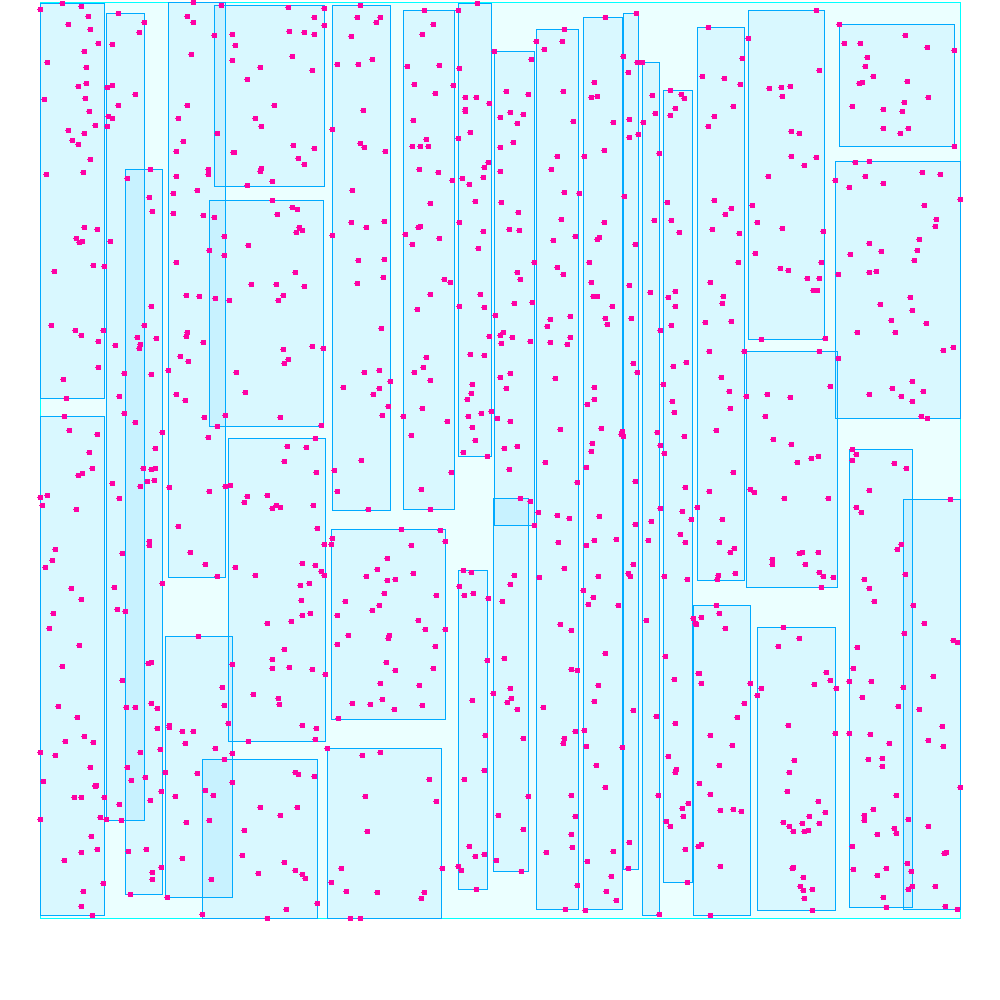

# R-tree indexing structure 🌳

## An 2-D tree for spatial indexing

### Features:

- Single threaded approach with variable minimum number of records and maximum number of records. 🗃️
- 2 methods for node splitting: LinearSplitting and QuadraticSplitting. 🌱
- Insert, Delete and 3 types of search methods: exactSearch(), rangeSearch() and knnSearch(). 🚀
- Multi-threaded approach with a fine-grained locking approach for search and a coarse grained locking for writing methods. 🔒
- Spark implementation with comparison between randomly partitioned records and comparison with spatially re-partitioned RDDs. 📊

### Visualization:

Here is an example of an R-tree with 1000 points as records and 16 as min page size and 50 as max page size with Quadratic splitting. The less overlap between the nodes, the slower the search queries will become.

### A bit of context:

A spatial index is more or less identical to a normal index: the role of any index is to allow very quick
access to a selection of items from a large amount of data. Spatial data objects are not well represented
by location points and represented in multi-dimensional spaces. R-trees are tree-like data structures used
to index those multidimensional information (called spatial data) in an efficient way.

A typical use case for
R-trees is the storage of geographic information such as restaurant locations or the processing of game static
data. A typical request might be ”find all the restaurants within a radius of 2 kilometers”.
The problem is that traditional one-dimensional structures database indexing are not suitable for multidimensional spatial searching. In particular, we can mention those that use an exact match with values
(hash table) or those that use key values ordering (B-Trees, ISAM).

Many structures have been proposed to handle multidimensional data: Cell methods, Quad trees, k-d
trees, K-D-B Trees. But for different reasons, these methods have proven to be not appropriate (not good
for dynamic structures, useful only for point data . . . ) [9]. Among the functional methods, we will deal in
particular with the R-tree structure, which represents data objects by intervals in several dimensions.
